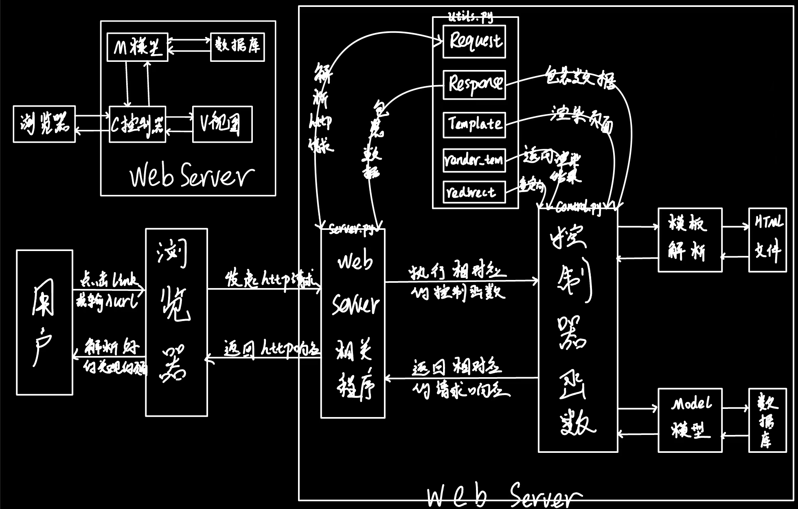

## ToDoList
本项目为阅读[用 Python 撸一个 Web 服务器](https://jianghushinian.cn/2020/07/17/%E7%94%A8-Python-%E6%92%B8%E4%B8%80%E4%B8%AA-Web-%E6%9C%8D%E5%8A%A1%E5%99%A8-%E7%AC%AC0%E7%AB%A0%EF%BC%9A%E5%BC%80%E7%AF%87%E8%AF%8D/)系列教程后构建的一个较为完整的WebServer项目

通过这个系列教程可以对Web开发理解更加透彻，对诸如Werkzeug、Flask这样的工具集或框架有更加深刻的认识

同时对于浏览器与Server的通信，数据的解析，数据的包装，模板的渲染，模型类以及控制函数有一个直观清晰的认识


### Socket
WebServer利用TCP/IP封装的Socket套接字实现与Client的通信

HTTP仅仅是一个通信格式规范，具体的Client与Server之间的通信依靠的是TCP/IP


### URL格式
```
scheme: https
host:port: search.jd.com
path: /Search
query: keyword=python%E4%B9%A6%E7%B1%8D&enc=utf-8
```


### 请求报文
Client发起一个HTTP请求产生一个请求报文发送给Server，下面列出GET/POST请求格式如下
```
GET / HTTP/1.1
Host: www.jd.com
Connection: keep-alive
User-Agent: Mozilla/5.0 (Macintosh; Intel Mac OS X 10_15_4) AppleWebKit/537.36 (KHTML, like Gecko) Chrome/83.0.4103.61 Safari/537.36
Accept: text/html,application/xhtml+xml,application/xml;q=0.9,image/webp,image/apng,*/*;q=0.8,application/signed-exchange;v=b3;q=0.9
```
```
POST /login HTTP/1.1
Host: www.jd.com
Connection: keep-alive
User-Agent: Mozilla/5.0 (Macintosh; Intel Mac OS X 10_15_4) AppleWebKit/537.36 (KHTML, like Gecko) Chrome/83.0.4103.61 Safari/537.36
Accept: text/html,application/xhtml+xml,application/xml;q=0.9,image/webp,image/apng,*/*;q=0.8,application/signed-exchange;v=b3;q=0.9

username=test&password=pass
```


### 响应报文
当WebServer利用控制函数拿到相对应的数据后就需要包装数据，使其HTTP响应规范，一个响应报文的格式如下
```
HTTP/1.1 200 OK
Connection: keep-alive
Content-Type: text/html

<html>XXX</html>
```


### 控制函数
```
一个个由Client发来的HTTP请求都对应着一个个的控制函数，
控制函数根据Request解析出的信息去调用Model类型提供的方法操作数据，
对于拿到的数据利用Template类进行渲染填充数据得到新的HTML模板，
而后利用Response类对数据进行包装返回给Client
```

### Request类
```
当一个HTTP请求报文从Client到达WebServer便会调起Request类进行解析，得到method、path、body等

根据这些信息可以返回给Client相对应的页面（数据）
```

### Model类
```
Model类在控制函数以及数据之间加起来一座桥梁，控制函数通过调用Model提供的方法对数据进行增删改查

所以Model类是对保存在硬盘（这里不讨论缓存）上的数据进行操作封装的
```

### Template类
```
Template类提供了对HTML模板的渲染，为什么需要这个类？因为通过渲染，

可以让从查询到的数据动态的添加到HTML模板中（事先需要定义好占位符），

所以Template类是对HTML模板进行渲染并提供了render方法供调用
```

### Response类
```
将需要返回的数据进行包装，包装成符合HTTP响应报文规范的数据，而这靠的是Response类
```


### 执行流程图
